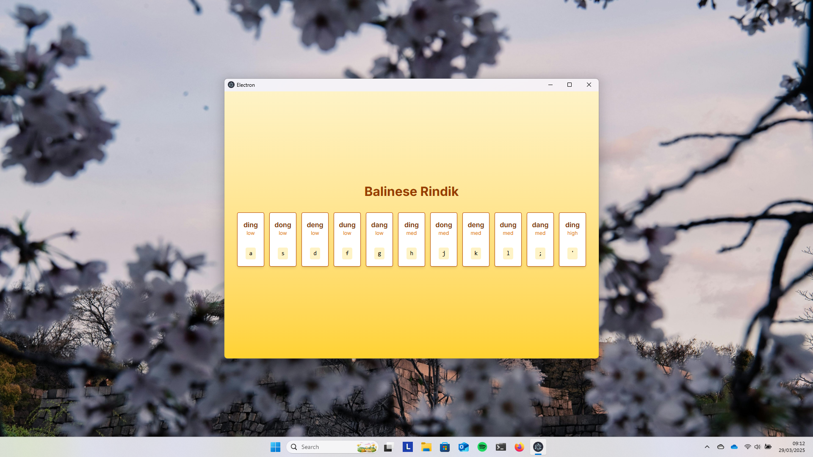

> [!NOTE]  
> Dokumentasi ini ditulis dalam Bahasa Indonesia. Lihat versi [English](docs/readme-eng.md) untuk dokumentasi berbahasa Inggris.

# Rindik Desktop


**Rindik Desktop** adalah aplikasi desktop untuk memainkan [Rindik Bali](https://id.wikipedia.org/wiki/Rindik) secara virtual menggunakan keyboard laptop atau komputer.

Aplikasi ini mensimulasikan alat musik tradisional _rindik_ yang terbuat dari bambu, dan memungkinkan pengguna untuk memainkan nada-nada rindik secara real-time.



---

## 📦 Fitur Utama

- 🎹 Gunakan keyboard untuk memainkan nada-nada rindik.
- 🎧 Audio realistis berbasis _sample-based synthesis_.
- ⚙️ Cross-platform: Windows, macOS, dan Linux.
- 🪄 UI simpel dan intuitif menggunakan SolidJS.
- 💾 Dapat dijalankan via source code _atau_ installer.

---

## 🚀 Cara Menjalankan Program

### 1. Jalankan dari Source Code

1. Clone repository:

   ```bash
   git clone <url-repo-ini>
   cd rindik-desktop
   ```

2. Install dependencies:

   ```bash
   npm install
   ```

3. Jalankan aplikasi dalam mode development:

   ```bash
   npm run dev
   ```

4. Build aplikasi ke installer (opsional):
   ```bash
   npm run build:win   # Untuk Windows
   npm run build:mac   # Untuk macOS
   npm run build:linux # Untuk Linux
   ```

### 2. Jalankan via Installer

Cara termudah. Cukup unduh file `.msi`, `.dmg`, atau `.AppImage` dari halaman **Release**, lalu jalankan.

---

## 🧠 Tech Stack & Hal yang Saya Pelajari

| Teknologi                                                       | Penjelasan                                    |
| --------------------------------------------------------------- | --------------------------------------------- |
| [ElectronJS](https://www.electronjs.org/)                       | Untuk membangun aplikasi desktop berbasis web |
| [Electron-Vite](https://github.com/electron-vite/electron-vite) | Untuk konfigurasi modern bundling Electron    |
| [SolidJS](https://www.solidjs.com/)                             | Untuk membangun UI yang ringan dan reaktif    |
| [Electron Builder](https://www.electron.build/)                 | Untuk membungkus aplikasi ke dalam installer  |

**Catatan pembelajaran pribadi**:

- Bagaimana audio bekerja di browser, terutama dalam konteks `AudioBuffer`, `AudioContext`, dan latensi input keyboard.
- Menangani _cross-platform packaging_ menggunakan `electron-builder`.
- Penggunaan reactive state di SolidJS (beda dengan React).

---

## 👨‍💻 Kontribusi

Kontribusi sangat terbuka! Jika kamu menemukan bug atau ingin menambahkan fitur, silakan:

1. Fork repo ini.
2. Buat branch baru: `git checkout -b fitur-anda`.
3. Commit perubahan.
4. Buat pull request.

---

## 📄 Lisensi

**Lisensi: Creative Commons Non-Commercial (CC BY-NC 4.0)**  
Dokumen ini dan seluruh kode sumber proyek ini dilisensikan di bawah [Creative Commons Attribution-NonCommercial 4.0 International (CC BY-NC 4.0)](https://creativecommons.org/licenses/by-nc/4.0/).

> [!NOTE]
> Kamu bebas untuk:
>
> - Menggunakan
> - Menyalin dan menyebarkan
> - Memodifikasi untuk kebutuhan pribadi atau pendidikan
>
> **Asal tidak digunakan untuk tujuan komersial**.
