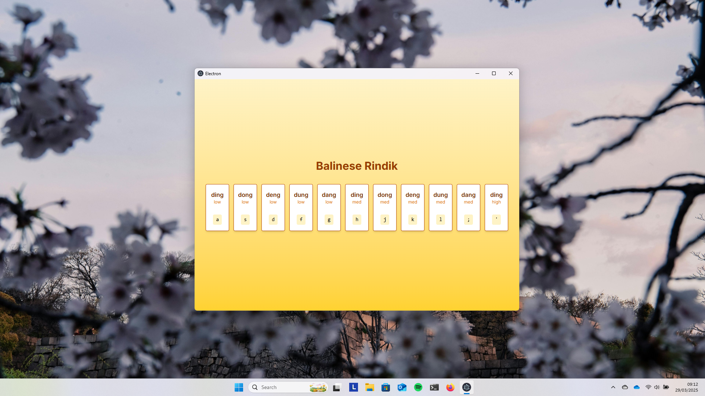

> [!NOTE]  
> This documentation is written in English. See the [Indonesian](/README.md) version for documentation in Bahasa Indonesia.

# Rindik Desktop


**Rindik Desktop** is a desktop application to play [Balinese Rindik](https://en.wikipedia.org/wiki/Rindik) virtually using a laptop or computer keyboard.
This application simulates the traditional bamboo musical instrument _rindik_, allowing users to play rindik notes in real-time.


---

## 📦 Main Features

- 🎹 Use keyboard to play rindik notes.
- 🎧 Realistic audio based on _sample-based synthesis_.
- ⚙️ Cross-platform: Windows, macOS, and Linux.
- 🪄 Simple and intuitive UI using SolidJS.
- 💾 Can be run via source code _or_ installer.

---

## 🚀 How to Run the Program

### 1. Run from Source Code

1. Clone repository:
   ```bash
   git clone <this-repo-url>
   cd rindik-desktop
   ```
2. Install dependencies:
   ```bash
   npm install
   ```
3. Run the application in development mode:
   ```bash
   npm run dev
   ```
4. Build application to installer (optional):
   ```bash
   npm run build:win   # For Windows
   npm run build:mac   # For macOS
   npm run build:linux # For Linux
   ```

### 2. Run via Installer

The easiest way. Simply download the `.msi`, `.dmg`, or `.AppImage` file from the **Release** page, then run it.

## 🧠 Tech Stack & What I Learned

| Technology                                                      | Explanation                                   |
| --------------------------------------------------------------- | --------------------------------------------- |
| [ElectronJS](https://www.electronjs.org/)                       | For building web-based desktop applications   |
| [Electron-Vite](https://github.com/electron-vite/electron-vite) | For modern Electron bundling configuration    |
| [SolidJS](https://www.solidjs.com/)                             | For building lightweight and reactive UI      |
| [Electron Builder](https://www.electron.build/)                 | For packaging the application into installers |

**Personal learning notes**:

- How audio works in browsers, especially in the context of `AudioBuffer`, `AudioContext`, and keyboard input latency.
- Handling _cross-platform packaging_ using `electron-builder`.
- Using reactive state in SolidJS (different from React).

---

## 👨‍💻 Contribution

Contributions are very welcome! If you find a bug or want to add a feature, please:

1. Fork this repo.
2. Create a new branch: `git checkout -b your-feature`.
3. Commit your changes.
4. Create a pull request.

---

## 📄 License

**License: Creative Commons Non-Commercial (CC BY-NC 4.0)**  
This document and all source code for this project are licensed under the [Creative Commons Attribution-NonCommercial 4.0 International (CC BY-NC 4.0)](https://creativecommons.org/licenses/by-nc/4.0/).

> [!NOTE]
> You are free to:
>
> - Use
> - Copy and distribute
> - Modify for personal or educational needs
>
> **As long as it is not used for commercial purposes**.
